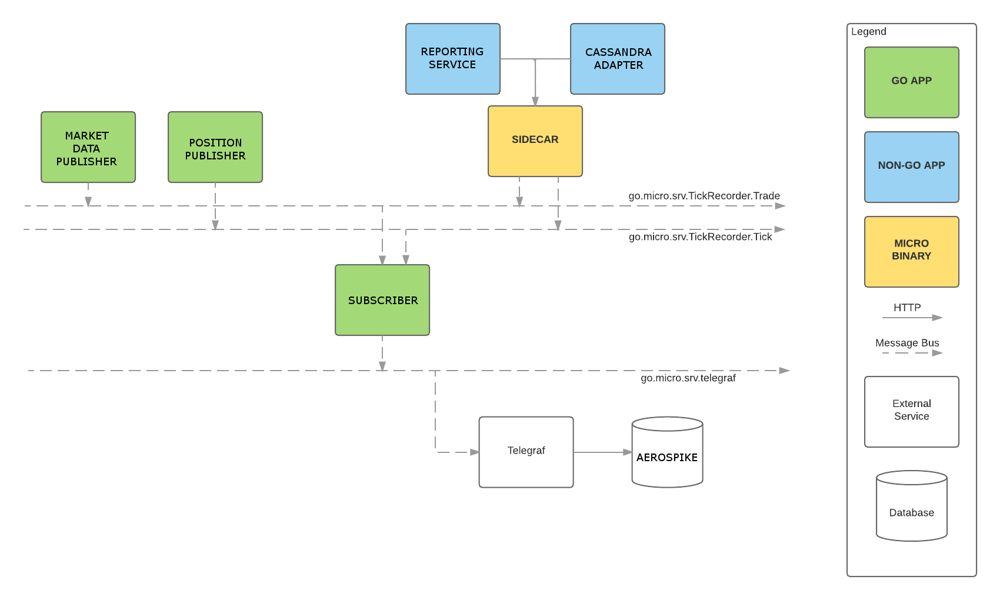

# sumoproto

sumo prototype - Microservices with NATS message bus



This repo is a complete demo of using [Micro](https://github.com/micro/micro) and [NATS](https://nats.io).

## Installation

### Dependencies

- [Go 1.10](https://golang.org/)
- [Glide](https://glide.sh/)
- [NATS](http://nats.io/)
- [Docker](https://www.docker.com/)

### Spinup

```bash
go get -d github.com/ilovelili/sumoproto/...
cd $GOPATH/src/github.com/ilovelili/sumoproto
glide install
docker build -t sumoprpto:0.1 .
docker-compose build && docker-compose up
```

## Usage

In its current state, the swarm will:

- Subscribe to the Broker Gateway
- Pull out USDJPY ticker data
- Publish onto the NATS queue
- Be received by the tickRecorder service
- Write the data point into InfluxDB

### Micro Web Console

`http://localhost:8082`

### NATS

Install nats-top

```bash
go get github.com/nats-io/nats-top
```

Run nats-top

```bash
nats-top
```

### InfluxDB

Web console: `http://localhost:8083`
Change the database at the top right to `sumo` and run this query: `select * from tick`

### Chronograf

Visualisations of InfluxDB are available using [chronograph](https://influxdata.com/time-series-platform/chronograf/), just visit `http://localhost:10000`

### Ideas

- A service that writes into Aerospike instead of InfluxDB
- A service that opens and closes trades for you
- A service that pulls historical data from InfluxDB in a defined time resolution
- Using go-micro's sidecar to allow writing algorithms in any language